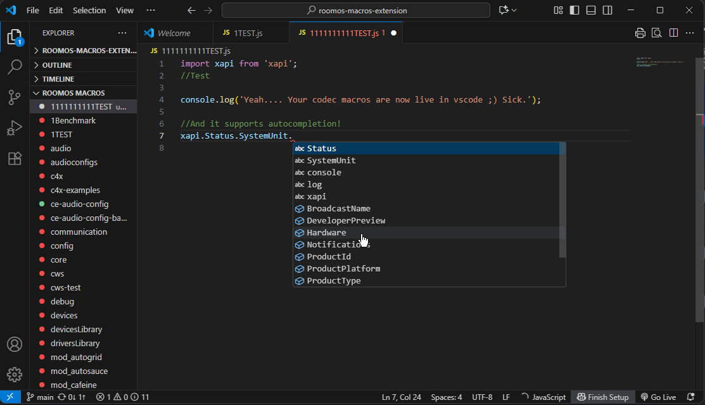
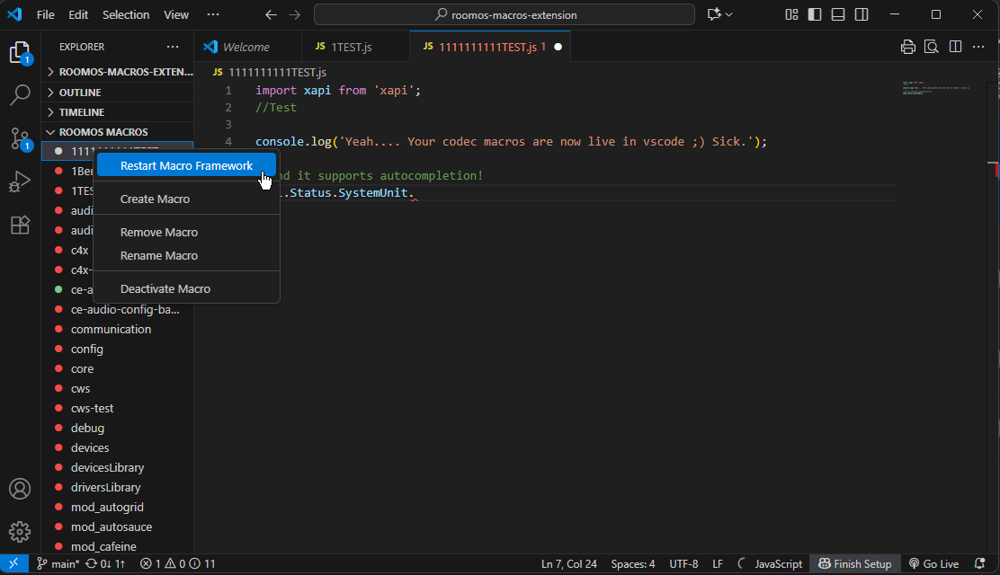
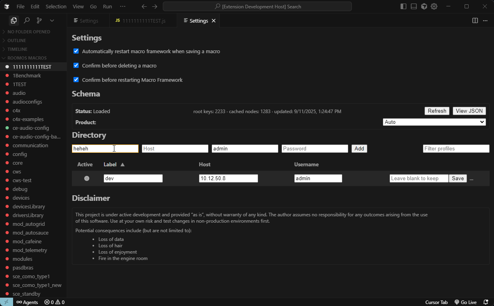

## RoomOS Macro Editor – VS Code Extension

Edit and manage Cisco RoomOS codec macros directly from VS Code. Browse, open, edit, create, rename, activate/deactivate, and remove macros on your device, with multi‑codec profile support and a virtual filesystem.

### Key features

- Browse macros in the Codec Macros explorer
- Open/edit macros via a virtual filesystem (`codecfs:`) by clicking items
- Save, create, rename, remove, activate/deactivate macros
- Restart macro framework from the context menu
- Multi‑codec profiles directory (secure credentials storage) with a management UI
- Seamless profile switching without reloading
- xAPI schema‑aware IntelliSense (completion, optional hover)
- xAPI help panel and stub insertion (experimental)
- Product filter for schema: Auto‑detect or force a specific device
- Settings toggles for confirmation prompts (macro delete, framework restart)
- Schema management: Refresh and View JSON

### Requirements

- Node.js 18+ / npm
- VS Code 1.75+
- Network access to the Cisco codec (Room/Board/Desk series)
- Admin credentials on the target codec

### Installation (development)

1. Install dependencies:
   - `npm install`
2. Build:
   - `npm run compile`
3. Launch in VS Code:
   - Press F5 (Run Extension) to open a Development Host

### Getting started

1. Open the Codec Macros explorer (Activity Bar → Explorer → Codec Macros)
2. Manage profiles (devices) via the view toolbar → “Settings”
   - Add profiles by specifying Label, Host, Username, Password
   - Set Active to pick the current device; switching connects seamlessly
   - Passwords are stored in VS Code Secrets; host/username/label in global storage
3. After connecting, your macros appear in the tree
4. Click a macro to open it. Edit as desired and press Ctrl+S to save
   - On save you’ll see “Saved macro <name>” and the “unsaved” badge clears

### xAPI IntelliSense, Help, and Stubs (Experimental)

These features use the public RoomOS xAPI schema to enhance editing. Behavior may change.

- Completion
  - Suggestions auto‑popup as you type after `xapi.` and segments like `Command`, `Status`, etc.
  - Rich schema details (description, params) show when you explicitly invoke completion (press Ctrl+Space).
  - Works in `codecfs:` JavaScript/TypeScript files.

- Help panel
  - Right‑click on an xAPI path (e.g., `xapi.Command.Audio.Diagnostics.Advanced.Run`) → “xAPI: Show Help for Symbol”.
  - Opens a panel with the node kind, access, roles, description, and a parameter table.

- Insert stubs
  - Right‑click → “xAPI: Insert Stub”, or run it from the Command Palette.
  - Inserts a sensible snippet based on the node type:
    - Command: `xapi.Command.<Path>({ Param: Default, ... });`
    - Config: `xapi.Config.<Path> = …;`
    - Status: `const value = await xapi.Status.<Path>.get();`
    - Event: `xapi.Event.<Path>.on((event) => { … });`

Note: These features are experimental. If completion doesn’t appear, ensure the file uses the `codecfs:` scheme and “Apply xAPI schema to IntelliSense” is enabled in Settings.

### Screenshots

Codec Macros explorer and editor:

Context menu:

Settings panel:

### Explorer actions (context menu)

- Create Macro: prompts for a name, creates an empty macro, opens it
- Rename Macro: atomically renames on device (xAPI Rename)
- Remove Macro: removes from device (xAPI Remove)
- Activate Macro: enables the macro (xAPI Activate)
- Deactivate Macro: disables the macro (xAPI Deactivate)
- Restart Macro Framework: restarts the macro runtime on the device

### Dirty‑state indicator

When a `codecfs:` document has unsaved changes, its item in the tree shows the description “unsaved”. The badge updates live on change/open/save/close.

### Profiles directory (credentials)

- Profiles are managed in a dedicated webview (Manage Codec Profiles)
- Storage:
  - Host/username/label: VS Code Global State (per‑user on this machine)
  - Passwords: VS Code Secrets (Keychain/Credential Manager/Keyring)
- Editing a profile allows inline changes (Label, Host, Username), and optional password update
- Switching profiles reconnects and hot‑swaps the active device in the explorer and filesystem without reloading

### Settings & preferences

- Automatically restart macro framework when saving a macro (default: on)
- Automatically restart macro framework when activating/deactivating a macro (default: on)
- Schema product selection:
  - Auto: use device detection
  - Choose a specific product to filter schema/IntelliSense
- Apply xAPI schema to IntelliSense (default: on)
- Show schema help on hover while typing (default: off)
- Confirmation prompts:
  - Confirm before deleting a macro
  - Confirm before restarting the Macro Framework
### Security considerations

- Passwords are stored using VS Code’s secure secret storage

### Troubleshooting

- Cannot connect
  - Verify IP/hostname, credentials, and that the codec allows WebSocket connections over `wss:`

### Development scripts

- Install deps: `npm install`
- Build once: `npm run build`
- Package VSIX: `npm run pak`
- Output: `dist/RoomOS-Macro-Editor-<version>.vsix`

After building or packaging, install the generated `.vsix` (e.g., `dist/RoomOS-Macro-Editor-*.vsix`) via the Extensions view three‑dot menu → “Install from VSIX…`.

### License

MIT. Cisco, RoomOS, and related marks are property of their respective owners.

